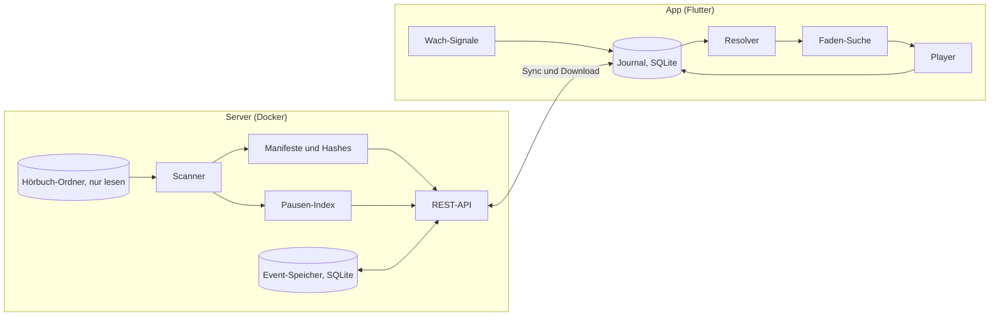

# Architektur: Faden

## 1. Überblick



Grundsatz: Der Server speichert Dateien, Manifeste und Events und entscheidet nichts. Die Position berechnet ausschließlich der Client (Resolver). So funktioniert die App offline vollständig, und die Logik existiert nur einmal.

## 2. Datenmodell (Server, SQLite im WAL-Modus)

| Tabelle | Felder |
|---|---|
| `files` | `file_hash` PK, `path`, `size`, `mtime_ns`, `duration_ms`, `disc`, `track`, `title` |
| `books` | `book_id` PK (UUID), `path`, `title`, `author`, `created_at` |
| `manifests` | `manifest_id` PK, `book_id`, `version`, `status` (`active`, `pending`, `needs_review`, `superseded`), `created_at` |
| `manifest_files` | `manifest_id`, `idx`, `file_hash`, PK (`manifest_id`, `idx`) |
| `pauses` | `file_hash` PK, `offsets_ms` (JSON), `params` (JSON) |
| `events` | `seq` PK autoincrement, `event_id` UNIQUE, `book_id`, `device_id`, `body` (JSON), `received_at`, `skew_flag` |

`manifest_id` = SHA-256 über die geordneten `file_hash`-Werte, getrennt durch Zeilenumbrüche.

## 3. Import und Manifest

### 3.1 Buch-Erkennung

- Ein Ordner mit MP3-Dateien ist ein Buch.
- Enthält ein Ordner nur Unterordner, deren Name auf `CD`, `Disc`, `Disk`, `Teil` oder `Part` plus Zahl passt (Groß/klein egal, Leerzeichen optional), ist er ein Buch; die Zahl ist die Disc-Nummer.
- `book_id` ist eine UUID, vergeben beim ersten Import. Verschwindet ein Pfad und taucht dieselbe Menge Datei-Hashes unter neuem Pfad auf, behält das Buch seine `book_id` (Umbenennung).

### 3.2 Reihenfolge

1. Schlüssel A: (Disc, Track) aus ID3 (`TPOS`, `TRCK`). Nur gültig, wenn jede Datei einen Track hat und alle (Disc, Track)-Paare eindeutig sind. Fehlt Disc: Disc aus dem Unterordner, sonst 1.
2. Schlüssel B: (Disc aus dem Unterordner, natürliche Sortierung des Dateinamens: Zahlen numerisch, Groß/klein egal, Unicode NFC).
3. A gültig und A = B → Reihenfolge A, Status `active`.
4. A gültig und A ≠ B → beide Reihenfolgen werden als Manifeste mit Status `needs_review` angelegt; die App lässt wählen, die Wahl wird `active`, die andere `superseded`.
5. A ungültig → Reihenfolge B, Status `active`.

Zusätzlich `needs_review` bei doppelten Hashes im Buch, Dauer 0 oder unlesbarer Datei.

### 3.3 Änderungen beim Rescan

| Fall | Ergebnis |
|---|---|
| Neue Liste = aktive Liste | nichts |
| Aktive Liste ist Präfix der neuen (nur angehängt) | neues Manifest sofort `active`, altes `superseded` |
| Alles andere | neues Manifest `pending`, altes bleibt `active` bis zur Bestätigung |
| Dateien fehlen auf der Platte | Buch „unvollständig“, Manifest und Positionen bleiben |

### 3.4 Audio-Hash (Tags werden ignoriert)

```text
audio_hash(datei):
  start = 0
  solange bytes[start : start+3] == "ID3":
    größe    = syncsafe_u32(bytes[start+6 : start+10])
    fußzeile = 10 wenn (bytes[start+5] & 0x10) sonst 0
    start   += 10 + größe + fußzeile

  ende = dateigröße
  wiederhole, solange sich ende ändert (höchstens 4 Durchläufe):
    wenn bytes[ende-128 : ende-125] == "TAG":
      ende -= 128
    sonst wenn bytes[ende-32 : ende-24] == "APETAGEX":
      größe = u32_le(bytes[ende-20 : ende-16])
      flags = u32_le(bytes[ende-12 : ende-8])
      ende -= größe + (32 wenn flags & 0x80000000 sonst 0)

  return hex(sha256(bytes[start : ende]))
```

- Streamend lesen (Blöcke à 1 MiB), nie die ganze Datei in den Speicher.
- Cache: (`path`, `size`, `mtime_ns`) → Hash; neu hashen nur bei Änderung.
- Dieselbe Berechnung gibt es in Dart (die App prüft Downloads). Beide Implementierungen nutzen dieselben Testfälle.
- Pflicht-Tests: gleiche Audiodaten mit anderen Tags oder anderem Namen → gleicher Hash; anderes Audio → anderer Hash; ID3v2 mit Fußzeile; APEv2 mit und ohne Header; ID3v1 und APEv2 kombiniert.

### 3.5 Dauer

Summe der Paketdauern per ffprobe, in ms gerundet. Nie aus der Bitrate geschätzt (VBR). Cache per Hash.

### 3.6 Metadaten

- Titel und Autor: ID3 `TALB` und `TPE1` der ersten Datei, sonst Ordnername nach Muster „Autor - Titel“, sonst Ordnername.
- Cover: `cover.jpg`, `cover.jpeg`, `cover.png`, `folder.jpg`, sonst eingebettetes Bild der ersten Datei, sonst keins (die App setzt ein Titel-Cover).

## 4. Pausen-Index

- `ffmpeg -i <datei> -af silencedetect=noise=-35dB:d=0.35 -f null -`; jedes `silence_end` ist ein Satzanfang.
- Pro Datei als sortierte Liste `offsets_ms` gespeichert, 0 für den Dateianfang immer enthalten.
- Parameter per Umgebungsvariable; sie werden in `params` mitgespeichert, bei Änderung wird neu berechnet.

## 5. Events

```json
{
  "event_id": "UUIDv7",
  "device_id": "UUID",
  "session_id": "UUID",
  "book_id": "UUID",
  "manifest_id": "hex",
  "type": "PLAY",
  "file_hash": "hex",
  "offset_ms": 0,
  "hlc": { "pt": 0, "c": 0 },
  "wall_ms": 0,
  "tz_min": 120,
  "source": "ui",
  "data": {}
}
```

`source`: `ui`, `media_button`, `timer`, `system`, `faden`. `tz_min`: UTC-Offset des Geräts in Minuten, nötig für das Nachtfenster.

| Typ | Wann | Absicht | Wach-Beleg |
|---|---|---|---|
| `PLAY` | Wiedergabe startet | ja | ja |
| `SEEK` | ±30 s, Kapitel, Scrubber, Verlauf | ja | ja |
| `RESUME` | Ergebnis der Faden-Suche oder „Ab Stopp weiterhören“ | ja | ja |
| `UNDO` | Rückgängig, „Früher“ | ja | ja |
| `HEARTBEAT` | alle 5 s während der Wiedergabe | nein | nein |
| `PAUSE` | Wiedergabe stoppt | nein | nur bei `source=ui` |
| `AWAKE` | Berührung, Lautstärke, Timer verlängert (höchstens 1 pro 10 s) | nein | ja |
| `SLEEP_HINT` | Sleep-Timer abgelaufen; Pause über Mediataste oder System im Nachtfenster | nein | nein |
| `PROBE` | Hörprobe der Faden-Suche, `data.known` | nein | nein |
| `FINISHED` | Buchende ohne Schlafverdacht erreicht | nein | ja |

Sessions: Jedes Absicht-Event außerhalb einer laufenden Wiedergabe beginnt eine neue `session_id`. Alle folgenden Events bis zur nächsten Pause tragen sie.

Hybrid Logical Clock:

```text
lokales Event:  pt = max(letzt.pt, jetzt)
                c  = (pt == letzt.pt) ? letzt.c + 1 : 0
empfangenes r:  pt = max(letzt.pt, r.pt, jetzt)
                c  = (pt == letzt.pt == r.pt) ? max(letzt.c, r.c) + 1
                   : (pt == letzt.pt)         ? letzt.c + 1
                   : (pt == r.pt)             ? r.c + 1
                   : 0
Ordnung:        (pt, c, device_id, event_id)
```

## 6. Sync

- Push zuerst: `POST /api/v1/events` mit bis zu 500 Events. Der Server speichert per `INSERT OR IGNORE` auf `event_id`. Antwort: Anzahl angenommen, Anzahl Duplikate, höchste `seq`.
- Dann Pull: `GET /api/v1/events?since=<seq>&limit=500`, bis `has_more = false`. Cursor lokal speichern.
- Auslöser: App-Start, App im Vordergrund, Pause, Netzwechsel, alle 60 s während der Wiedergabe.
- Events mit `hlc.pt` > Serverzeit + 10 Min bekommen `skew_flag` und werden geloggt. Bekannte Grenze: Ein Gerät mit stark vorgehender Uhr kann fälschlich gewinnen.
- Events werden im MVP nie gelöscht.

## 7. Resolver (pur, Dart)

Eingabe: alle Events eines Buchs, die Manifeste, Einstellungen (Nachtfenster). Ausgabe:

```text
BookState {
  position: Pos(file_hash, offset_ms)
  global_ms: int
  last_awake: Pos
  stop: Pos
  sleep_suspected: bool
  history: List<Pos>          // neueste zuerst, höchstens 20
  finished: bool
  needs_confirmation: bool
}
```

Regeln:
1. Nach HLC sortieren, doppelte `event_id` ignorieren.
2. Das letzte Absicht-Event (`PLAY`, `SEEK`, `RESUME`, `UNDO`) bestimmt die gewinnende Session.
3. `position` = Position des letzten Events der gewinnenden Session. Events anderer Sessions bewegen die Position nie, auch wenn sie später eintreffen.
4. `last_awake` = Position des letzten Wach-Belegs der gewinnenden Session.
5. `sleep_suspected` = Abstand(`last_awake`, `stop`) ≥ 3 Min UND (ein Event der Session liegt in Gerätezeit im Nachtfenster ODER die Session enthält `SLEEP_HINT`) UND nach dem Stopp folgte kein `RESUME`.
6. `history`: Springt ein Absicht-Event mehr als 2 Min von der vorherigen Position weg, kommt die vorherige Position in `history`.
7. `finished` = `FINISHED` in der gewinnenden Session und `sleep_suspected` ist falsch.
8. Abstände über globale ms des aktiven Manifests. Fehlt ein `file_hash` im aktiven Manifest: `needs_confirmation = true`, die Position bleibt unangetastet.

Testfälle in `spec/vectors/`, je eine JSON-Datei mit `settings`, `manifest`, `events`, `expect`:
1. Ein Gerät, Herzschläge, Pause → Position der Pause.
2. Doppelte Events → gleicher Zustand wie ohne Duplikate.
3. A spielt, B startet später, A schickt danach noch Herzschläge → Position von B.
4. A war offline mit älterer Session und synct nach B → B bleibt.
5. Nachtfenster, 20 Min ohne Wach-Beleg, Timer-Ende → `sleep_suspected`, `last_awake` korrekt.
6. Kapitelsprung über 2 Min, dann `UNDO` → alte Position, `history` korrekt.
7. Manifest nur angehängt → Position unverändert.
8. Buchende mit Schlafverdacht → `finished = false`.

## 8. Faden-Suche (pur, Dart; im Prototyp JavaScript)

```text
Parameter
  target        = 30_000   ms Zielgenauigkeit
  max_probes    = 8        inklusive Probe 1
  probe_len     = 4_000    ms
  answer_window = 3_000    ms nach Ende der Probe (Antworten während der Probe zählen)
  first_offset  = 25_000   ms vor dem Stopp
  preroll       = 2_000    ms

suche(lo, hi, pausen, frage, prior = null) -> (start, leiter)
  // lo = last_awake, hi = stop, beides globale ms
  wenn hi - lo <= target:
    return (max(lo - preroll, 0), [lo])

  leiter = [lo]
  proben = 0

  wenn prior == null:                          // Probe 1: Fehlalarm-Test
    p = snap(hi - first_offset, lo, hi, tol = 2_000)
    proben += 1
    wenn frage(p): return (p, [lo, p])
    hi = p

  solange hi - lo > target und proben < max_probes:
    x = (proben == 0 und prior != null) ? prior : lo + (hi - lo) / 2
    p = snap(x, lo, hi, tol = max(2_000, 0.03 * (hi - lo)))
    proben += 1
    wenn frage(p): lo = p; leiter.append(p)
    sonst:         hi = p

  start = (lo == leiter[0]) ? max(lo - preroll, 0) : lo
  return (start, leiter)

snap(x, lo, hi, tol):
  k = { s in pausen | lo + probe_len < s < hi - probe_len und |s - x| <= tol }
  wenn k leer: return x
  return das s aus k mit kleinstem |s - x|
```

Eigenschafts-Tests mit simuliertem Hörer („kennt p genau dann, wenn p ≤ S“, S zufällig in [lo, hi]):
1. `start ≤ S` immer. Es wird nie Ungehörtes übersprungen.
2. Fenster ≤ 30 Min → `S - start ≤ target + preroll`.
3. Nie mehr als `max_probes` Proben.
4. Hörer antwortet nie → `start = max(lo - preroll, 0)`.
5. „Früher“ springt in `leiter` genau einen Schritt zurück.

Weitere Regeln: Eine Probe endet spätestens am Dateiende. Proben laufen über einen eigenen Player, der Hauptplayer ist pausiert. Jede Probe wird als `PROBE`-Event geschrieben, das Ergebnis als `RESUME`-Event.

## 9. Wach-Signale und Schlafverdacht (App)

- `AWAKE` entsteht bei Berührung des Player-Screens, Lautstärkeänderung (falls die Plattform sie meldet) und Timer-Verlängerung.
- `SLEEP_HINT` entsteht beim Ablauf des Sleep-Timers und bei einer Pause über Mediataste oder System im Nachtfenster. Die AirPods-Einschlaferkennung (ab iOS 26) kommt als normale Pause an und ist von einem bewussten Tastendruck nicht zu unterscheiden, daher nur Hinweis.
- Gesundheitsdaten (M6) erzeugen keine Events. Beim Start der Faden-Suche liest die App lokal den Schlafbeginn T im Zeitraum der Session und rechnet T über die `HEARTBEAT`-Events (Wanduhr → Position) in globale ms um. Dann gilt: `hi = min(stop, pos(T + 5 Min))`, `prior = pos(T - 10 Min)` falls > `lo`. `lo` wird nie aus Gesundheitsdaten gesetzt (Invariante 9).
- Mediatasten: normal Play/Pause, Weiter = +30 s, Zurück = −30 s. In der letzten Minute des Sleep-Timers verlängert jede Taste. Im Faden-Modus zählt jede Taste als „kenne ich“.

## 10. API

Alle Endpunkte außer `/api/v1/health` verlangen `Authorization: Bearer <FADEN_TOKEN>`.

| Methode | Pfad | Zweck |
|---|---|---|
| GET | `/api/v1/health` | Status |
| GET | `/api/v1/books` | Bücher: id, Titel, Autor, Dauer, Status |
| GET | `/api/v1/books/{book_id}` | aktives Manifest mit Dateien, dazu `pending` oder `needs_review`-Kandidaten |
| GET | `/api/v1/books/{book_id}/cover` | Cover oder 404 |
| GET | `/api/v1/books/{book_id}/pauses` | Pausen-Index je `file_hash` |
| POST | `/api/v1/books/{book_id}/manifests/{manifest_id}/confirm` | Kandidat bestätigen → `active` |
| GET | `/api/v1/files/{file_hash}` | Audiodatei mit HTTP-Range |
| POST | `/api/v1/events` | Events hochladen, idempotent |
| GET | `/api/v1/events?since={seq}&limit={n}` | Events abholen |
| POST | `/api/v1/rescan` | Ordner neu einlesen |

## 11. App

```text
app/lib/
  core/     hlc.dart, ids.dart, clock.dart
  domain/   position.dart, manifest.dart, event.dart, resolver.dart,
            faden_search.dart, audio_hash_bounds.dart      (pur, keine Flutter-Imports)
  data/     db.dart (drift), journal.dart, sync.dart, api.dart, downloads.dart, hash_file.dart
  audio/    handler.dart (audio_service), player.dart (just_audio), probe_player.dart
  signals/  awake.dart, night.dart, health.dart
  ui/       theme.dart, player_screen.dart, details_sheet.dart, faden_screen.dart,
            library_screen.dart, settings_screen.dart
  l10n/     app_de.arb
app/test/   domain/, data/   (Resolver-Tests laden ../spec/vectors/*.json)
```

Player-Regeln:
- Playlist = alle Dateien des aktiven Manifests; lokale Datei, sonst Stream-URL mit Token-Header.
- Lückenlose Übergänge, Hintergrundwiedergabe, Steuerung auf dem Sperrbildschirm.
- App-Start: Resolver ausführen, Player an der Position pausiert vorbereiten.
- Buchende: stoppen; `FINISHED` nur ohne Schlafverdacht. Nie ins nächste Buch.
- Ein Download gilt erst als fertig, wenn der Audio-Hash der Datei stimmt.

## 12. Betrieb

```yaml
services:
  faden:
    build: ./server
    ports: ["8787:8787"]
    env_file: .env
    volumes:
      - /pfad/zu/hoerbuechern:/library:ro
      - faden-data:/data
    restart: unless-stopped
volumes:
  faden-data:
```

| Variable | Standard | Zweck |
|---|---|---|
| `FADEN_TOKEN` | Pflicht | Bearer-Token |
| `FADEN_LIBRARY` | `/library` | Hörbuch-Ordner, nur lesen |
| `FADEN_DATA` | `/data` | SQLite und Caches |
| `FADEN_PORT` | `8787` | Port |
| `FADEN_RESCAN_MIN` | `10` | Rescan-Intervall in Minuten |
| `FADEN_SILENCE_DB` | `-35` | Schwelle für `silencedetect` |
| `FADEN_SILENCE_S` | `0.35` | Mindestdauer für `silencedetect` |

- Backup täglich: `sqlite3 /data/faden.db ".backup /data/backup/faden-<datum>.db"` (Skript `server/scripts/backup.sh`). Zusätzlich hält jedes Gerät alle Events, die es synchronisiert hat.
- Zugriff von unterwegs über ein VPN (z. B. WireGuard oder Tailscale), den Port nicht öffentlich freigeben.

## 13. Entscheidungen

| Nr. | Entscheidung | Grund |
|---|---|---|
| E1 | App in Flutter statt nativ | Eine Codebasis für iOS und Android; just_audio und audio_service decken Hintergrund und Mediatasten ab. Risiko: Tasten-Details je Plattform, daher Gerätetests in M4 und M5. |
| E2 | Server liest den Ordner direkt, Audiobookshelf höchstens optional (M7) | Weniger Abhängigkeiten, keine fremde Fortschrittslogik im Kern. |
| E3 | Resolver nur im Client | Server bleibt einfacher Speicher, keine doppelte Logik, offline vollständig. |
| E4 | Pausen-Index statt Transkript im MVP | ffmpeg reicht für Satzanfänge; Whisper später optional. |
| E5 | Hash über reine Audiodaten | Umbenennen und Taggen ändern nichts; neu encodierte Dateien gelten als neue Dateien und brauchen eine Bestätigung. |
| E6 | Gesundheitsdaten nur als lokaler Hinweis | Datenschutz; `lo` bleibt durch Antworten belegt, dadurch nie Ungehörtes übersprungen. |

Neue Entscheidungen unten anhängen: Nummer, Entscheidung, Grund.
