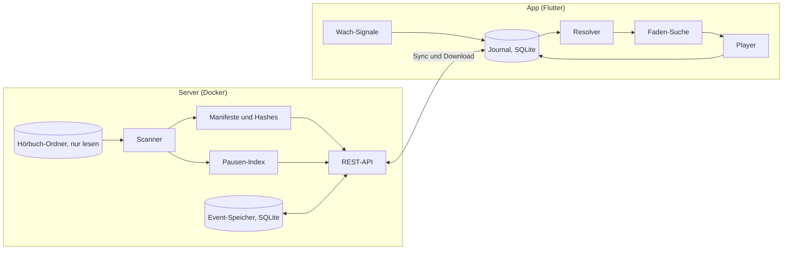

# Architektur: Faden

## 1. Überblick



Grundsatz: Der Server speichert Dateien, Manifeste und Events und entscheidet nichts. Die Position berechnet ausschließlich der Client (Resolver). So funktioniert die App offline vollständig, und die Logik existiert nur einmal.

## 2. Datenmodell (Server, SQLite im WAL-Modus)

| Tabelle | Felder |
|---|---|
| `files` | `file_hash` PK, `path`, `size`, `mtime_ns`, `duration_ms`, `disc`, `track`, `title` |
| `books` | `book_id` PK (UUID), `path`, `title`, `author`, `created_at` |
| `manifests` | `manifest_id` PK, `book_id`, `version`, `status` (`active`, `pending`, `needs_review`, `superseded`), `created_at` |
| `manifest_files` | `manifest_id`, `idx`, `file_hash`, PK (`manifest_id`, `idx`) |
| `pauses` | `file_hash` PK, `offsets_ms` (JSON), `params` (JSON) |
| `events` | `seq` PK autoincrement, `event_id` UNIQUE, `book_id`, `device_id`, `body` (JSON), `received_at`, `skew_flag` |
| `settings` | `key` PK, `value` |

`manifest_id` = SHA-256 über die geordneten `file_hash`-Werte, getrennt durch Zeilenumbrüche.

`settings.library_path`: relativer Unterpfad unter `FADEN_LIBRARY` (Wurzel-Mount), der die tatsächliche Bibliothek markiert. Leer/fehlend = die Wurzel selbst. Siehe Abschnitt 10 (Setup-Endpunkte) und Abschnitt 12 (Mount-Semantik).

## 3. Import und Manifest

### 3.1 Buch-Erkennung

- Ein Ordner mit MP3-Dateien ist ein Buch.
- Enthält ein Ordner nur Unterordner, deren Name auf `CD`, `Disc`, `Disk`, `Teil` oder `Part` plus Zahl passt (Groß/klein egal, Leerzeichen optional), ist er ein Buch; die Zahl ist die Disc-Nummer.
- `book_id` ist eine UUID, vergeben beim ersten Import. Verschwindet ein Pfad und taucht dieselbe Menge Datei-Hashes unter neuem Pfad auf, behält das Buch seine `book_id` (Umbenennung).

### 3.2 Reihenfolge

1. Schlüssel A: (Disc, Track) aus ID3 (`TPOS`, `TRCK`). Nur gültig, wenn jede Datei einen Track hat und alle (Disc, Track)-Paare eindeutig sind. Fehlt Disc: Disc aus dem Unterordner, sonst 1.
2. Schlüssel B: (Disc aus dem Unterordner, natürliche Sortierung des Dateinamens: Zahlen numerisch, Groß/klein egal, Unicode NFC).
3. A gültig und A = B → Reihenfolge A, Status `active`.
4. A gültig und A ≠ B → beide Reihenfolgen werden als Manifeste mit Status `needs_review` angelegt; die App lässt wählen, die Wahl wird `active`, die andere `superseded`.
5. A ungültig → Reihenfolge B, Status `active`.

Zusätzlich `needs_review` bei doppelten Hashes im Buch, Dauer 0 oder unlesbarer Datei.

### 3.3 Änderungen beim Rescan

| Fall | Ergebnis |
|---|---|
| Neue Liste = aktive Liste | nichts |
| Aktive Liste ist Präfix der neuen (nur angehängt) | neues Manifest sofort `active`, altes `superseded` |
| Alles andere | neues Manifest `pending`, altes bleibt `active` bis zur Bestätigung |
| Dateien fehlen auf der Platte | Buch „unvollständig“, Manifest und Positionen bleiben |

### 3.4 Audio-Hash (Tags werden ignoriert)

```text
audio_hash(datei):
  start = 0
  solange bytes[start : start+3] == "ID3":
    größe    = syncsafe_u32(bytes[start+6 : start+10])
    fußzeile = 10 wenn (bytes[start+5] & 0x10) sonst 0
    start   += 10 + größe + fußzeile

  ende = dateigröße
  wiederhole, solange sich ende ändert (höchstens 4 Durchläufe):
    wenn bytes[ende-128 : ende-125] == "TAG":
      ende -= 128
    sonst wenn bytes[ende-32 : ende-24] == "APETAGEX":
      größe = u32_le(bytes[ende-20 : ende-16])
      flags = u32_le(bytes[ende-12 : ende-8])
      ende -= größe + (32 wenn flags & 0x80000000 sonst 0)

  return hex(sha256(bytes[start : ende]))
```

- Streamend lesen (Blöcke à 1 MiB), nie die ganze Datei in den Speicher.
- Cache: (`path`, `size`, `mtime_ns`) → Hash; neu hashen nur bei Änderung.
- Dieselbe Berechnung gibt es in Dart (die App prüft Downloads). Beide Implementierungen nutzen dieselben Testfälle.
- Pflicht-Tests: gleiche Audiodaten mit anderen Tags oder anderem Namen → gleicher Hash; anderes Audio → anderer Hash; ID3v2 mit Fußzeile; APEv2 mit und ohne Header; ID3v1 und APEv2 kombiniert.

### 3.5 Dauer

Summe der Paketdauern per ffprobe, in ms gerundet. Nie aus der Bitrate geschätzt (VBR). Cache per Hash.

### 3.6 Metadaten

- Titel und Autor: ID3 `TALB` und `TPE1` der ersten Datei, sonst Ordnername nach Muster „Autor - Titel“, sonst Ordnername.
- Cover: `cover.jpg`, `cover.jpeg`, `cover.png`, `folder.jpg`, sonst eingebettetes Bild der ersten Datei, sonst keins (die App setzt ein Titel-Cover).

## 4. Pausen-Index

- `ffmpeg -i <datei> -af silencedetect=noise=-35dB:d=0.35 -f null -`; jedes `silence_end` ist ein Satzanfang.
- Pro Datei als sortierte Liste `offsets_ms` gespeichert, 0 für den Dateianfang immer enthalten.
- Parameter per Umgebungsvariable; sie werden in `params` mitgespeichert, bei Änderung wird neu berechnet.

## 5. Events

```json
{
  "event_id": "UUIDv7",
  "device_id": "UUID",
  "session_id": "UUID",
  "book_id": "UUID",
  "manifest_id": "hex",
  "type": "PLAY",
  "file_hash": "hex",
  "offset_ms": 0,
  "hlc": { "pt": 0, "c": 0 },
  "wall_ms": 0,
  "tz_min": 120,
  "source": "ui",
  "data": {}
}
```

`source`: `ui`, `media_button`, `timer`, `system`, `faden`. `tz_min`: UTC-Offset des Geräts in Minuten, nötig für das Nachtfenster.

| Typ | Wann | Absicht | Wach-Beleg |
|---|---|---|---|
| `PLAY` | Wiedergabe startet | ja | ja |
| `SEEK` | ±30 s, Kapitel, Scrubber, Verlauf | ja | ja |
| `RESUME` | Ergebnis der Faden-Suche oder „Ab Stopp weiterhören“ | ja | ja |
| `UNDO` | Rückgängig, „Früher“ | ja | ja |
| `HEARTBEAT` | alle 5 s während der Wiedergabe | nein | nein |
| `PAUSE` | Wiedergabe stoppt | nein | nur bei `source=ui` |
| `AWAKE` | Berührung, Lautstärke, Timer verlängert (höchstens 1 pro 10 s) | nein | ja |
| `SLEEP_HINT` | Sleep-Timer abgelaufen; Pause über Mediataste oder System im Nachtfenster | nein | nein |
| `PROBE` | Hörprobe der Faden-Suche, `data.known` | nein | nein |
| `FINISHED` | Buchende ohne Schlafverdacht erreicht | nein | ja |

Sessions: Jedes Absicht-Event außerhalb einer laufenden Wiedergabe beginnt eine neue `session_id`. Alle folgenden Events bis zur nächsten Pause tragen sie.

Hybrid Logical Clock:

```text
lokales Event:  pt = max(letzt.pt, jetzt)
                c  = (pt == letzt.pt) ? letzt.c + 1 : 0
empfangenes r:  pt = max(letzt.pt, r.pt, jetzt)
                c  = (pt == letzt.pt == r.pt) ? max(letzt.c, r.c) + 1
                   : (pt == letzt.pt)         ? letzt.c + 1
                   : (pt == r.pt)             ? r.c + 1
                   : 0
Ordnung:        (pt, c, device_id, event_id)
```

## 6. Sync

- Push zuerst: `POST /api/v1/events` mit bis zu 500 Events. Der Server prüft jedes Event einzeln und speichert die gültigen per `INSERT OR IGNORE` auf `event_id`. Antwort: `{"accepted", "duplicates", "rejected": [{"index", "event_id", "error"}], "max_seq"}` (`max_seq` ist `null`, wenn nichts gespeichert wurde). 422 nur, wenn der Request selbst kaputt ist (kein Array, mehr als 500 Events). Abgelehnte Events gelten beim Client als erledigt und bleiben lokal im Journal (E23).
- Dann Pull: `GET /api/v1/events?since=<seq>&limit=500`, bis `has_more = false`. Cursor lokal speichern. Jedes gezogene Event läuft vor dem Speichern durch die HLC-Empfangsregel (Abschnitt 5), damit spätere lokale Events danach einsortiert werden.
- Auslöser: App-Start, App im Vordergrund, Pause, Netzwechsel, alle 60 s während der Wiedergabe.
- Events mit `hlc.pt` > Serverzeit + 10 Min bekommen `skew_flag` und werden geloggt. Bekannte Grenze: Ein Gerät mit stark vorgehender Uhr kann fälschlich gewinnen.
- Events werden im MVP nie gelöscht.

## 7. Resolver (pur, Dart)

Eingabe: alle Events eines Buchs, die Manifeste, Einstellungen (Nachtfenster). Ausgabe:

```text
BookState {
  position: Pos(file_hash, offset_ms)
  global_ms: int
  last_awake: Pos
  stop: Pos
  sleep_suspected: bool
  history: List<Pos>          // neueste zuerst, höchstens 20
  finished: bool
  needs_confirmation: bool
}
```

Regeln:
1. Nach HLC sortieren, doppelte `event_id` ignorieren.
2. Das letzte Absicht-Event (`PLAY`, `SEEK`, `RESUME`, `UNDO`) bestimmt die gewinnende Session.
3. `position` = Position des letzten Events der gewinnenden Session. Events anderer Sessions bewegen die Position nie, auch wenn sie später eintreffen.
4. `last_awake` = Position des letzten Wach-Belegs der gewinnenden Session.
5. `sleep_suspected` = Abstand(`last_awake`, `stop`) ≥ 3 Min UND (ein Event der Session liegt in Gerätezeit im Nachtfenster ODER die Session enthält `SLEEP_HINT`) UND nach dem Stopp folgte kein `RESUME`.
6. `history`: Springt ein Absicht-Event mehr als 2 Min von der vorherigen Position weg, kommt die vorherige Position in `history`.
7. `finished` = `FINISHED` in der gewinnenden Session und `sleep_suspected` ist falsch.
8. Abstände über globale ms des aktiven Manifests. Fehlt ein `file_hash` im aktiven Manifest: `needs_confirmation = true`, die Position bleibt unangetastet.

Testfälle in `spec/vectors/`, je eine JSON-Datei mit `settings`, `manifest`, `events`, `expect`:
1. Ein Gerät, Herzschläge, Pause → Position der Pause.
2. Doppelte Events → gleicher Zustand wie ohne Duplikate.
3. A spielt, B startet später, A schickt danach noch Herzschläge → Position von B.
4. A war offline mit älterer Session und synct nach B → B bleibt.
5. Nachtfenster, 20 Min ohne Wach-Beleg, Timer-Ende → `sleep_suspected`, `last_awake` korrekt.
6. Kapitelsprung über 2 Min, dann `UNDO` → alte Position, `history` korrekt.
7. Manifest nur angehängt → Position unverändert.
8. Buchende mit Schlafverdacht → `finished = false`.

## 8. Faden-Suche (pur, Dart; im Prototyp JavaScript)

```text
Parameter
  target        = 30_000   ms Zielgenauigkeit
  max_probes    = 8        inklusive Probe 1
  probe_len     = 4_000    ms
  answer_window = 3_000    ms nach Ende der Probe (Antworten während der Probe zählen)
  first_offset  = 25_000   ms vor dem Stopp
  preroll       = 2_000    ms

suche(lo, hi, pausen, frage, prior = null) -> (start, leiter)
  // lo = last_awake, hi = stop, beides globale ms
  wenn hi - lo <= target:
    return (max(lo - preroll, 0), [lo])

  leiter = [lo]
  proben = 0

  wenn prior == null:                          // Probe 1: Fehlalarm-Test
    p = snap(hi - first_offset, lo, hi, tol = 2_000)
    proben += 1
    wenn frage(p): return (p, [lo, p])
    hi = p

  solange hi - lo > target und proben < max_probes:
    x = (proben == 0 und prior != null) ? prior : lo + (hi - lo) / 2
    p = snap(x, lo, hi, tol = max(2_000, 0.03 * (hi - lo)))
    proben += 1
    wenn frage(p): lo = p; leiter.append(p)
    sonst:         hi = p

  start = (lo == leiter[0]) ? max(lo - preroll, 0) : lo
  return (start, leiter)

snap(x, lo, hi, tol):
  k = { s in pausen | lo + probe_len < s < hi - probe_len und |s - x| <= tol }
  wenn k leer: return x
  return das s aus k mit kleinstem |s - x|
```

Eigenschafts-Tests mit simuliertem Hörer („kennt p genau dann, wenn p ≤ S“, S zufällig in [lo, hi]):
1. `start ≤ S` immer. Es wird nie Ungehörtes übersprungen.
2. Fenster ≤ 30 Min → `S - start ≤ target + preroll`.
3. Nie mehr als `max_probes` Proben.
4. Hörer antwortet nie → `start = max(lo - preroll, 0)`.
5. „Früher“ springt in `leiter` genau einen Schritt zurück.

Weitere Regeln: Eine Probe endet spätestens am Dateiende. Proben laufen über einen eigenen Player, der Hauptplayer ist pausiert. Jede Probe wird als `PROBE`-Event geschrieben, das Ergebnis als `RESUME`-Event.

## 9. Wach-Signale und Schlafverdacht (App)

- `AWAKE` entsteht bei Berührung des Player-Screens, Lautstärkeänderung (falls die Plattform sie meldet) und Timer-Verlängerung.
- `SLEEP_HINT` entsteht beim Ablauf des Sleep-Timers und bei einer Pause über Mediataste oder System im Nachtfenster. Die AirPods-Einschlaferkennung (ab iOS 26) kommt als normale Pause an und ist von einem bewussten Tastendruck nicht zu unterscheiden, daher nur Hinweis.
- Gesundheitsdaten (M6) erzeugen keine Events. Beim Start der Faden-Suche liest die App lokal den Schlafbeginn T im Zeitraum der Session und rechnet T über die `HEARTBEAT`-Events (Wanduhr → Position) in globale ms um. Dann gilt: `hi = min(stop, pos(T + 5 Min))`, `prior = pos(T - 10 Min)` falls > `lo`. `lo` wird nie aus Gesundheitsdaten gesetzt (Invariante 9).
- Mediatasten: normal Play/Pause, Weiter = +30 s, Zurück = −30 s. In der letzten Minute des Sleep-Timers verlängert jede Taste. Im Faden-Modus zählt jede Taste als „kenne ich“.

## 10. API

Alle Endpunkte außer `/api/v1/health` verlangen `Authorization: Bearer <FADEN_TOKEN>`.

| Methode | Pfad | Zweck |
|---|---|---|
| GET | `/api/v1/health` | Status |
| GET | `/api/v1/books` | Bücher: id, Titel, Autor, Dauer, Status |
| GET | `/api/v1/books/{book_id}` | aktives Manifest mit Dateien, dazu `pending` oder `needs_review`-Kandidaten |
| GET | `/api/v1/books/{book_id}/cover` | Cover oder 404 |
| GET | `/api/v1/books/{book_id}/pauses` | Pausen-Index je `file_hash` |
| POST | `/api/v1/books/{book_id}/manifests/{manifest_id}/confirm` | Kandidat bestätigen → `active` |
| GET | `/api/v1/files/{file_hash}` | Audiodatei mit HTTP-Range |
| POST | `/api/v1/events` | Events hochladen, idempotent |
| GET | `/api/v1/events?since={seq}&limit={n}` | Events abholen |
| POST | `/api/v1/rescan` | Ordner neu einlesen |
| GET | `/api/v1/setup/browse?path={rel}` | Unterordner von `path` unter `FADEN_LIBRARY` auflisten (nur Verzeichnisnamen, keine Dateien) |
| GET | `/api/v1/setup/library` | aktuell gewählter `settings.library_path` |
| POST | `/api/v1/setup/library` | `{"path": "<rel>"}` setzen, danach sofortiger Rescan |

Setup-Endpunkte verlangen ebenfalls `Authorization: Bearer <FADEN_TOKEN>`. `path` ist relativ zu `FADEN_LIBRARY` und wird serverseitig aufgelöst und geprüft, dass das Ergebnis innerhalb von `FADEN_LIBRARY` bleibt (kein `..`, keine Symlinks nach außerhalb) — Invariante 8 gilt weiter, es wird nur gelesen. Eine winzige statische Seite `server/static/setup.html` (Vanilla JS, kein Framework, Stil wie `prototype/faden.html`) nutzt diese drei Endpunkte: Token einmalig eingeben (nur im Browser-Tab gehalten), Ordner anklicken, bestätigen.

## 11. App

```text
app/lib/
  core/     hlc.dart, ids.dart, clock.dart
  domain/   position.dart, manifest.dart, event.dart, resolver.dart,
            faden_search.dart, audio_hash_bounds.dart      (pur, keine Flutter-Imports)
  data/     db.dart (drift), journal.dart, sync.dart, api.dart, downloads.dart, hash_file.dart
  audio/    handler.dart (audio_service), player.dart (just_audio), probe_player.dart
  signals/  awake.dart, night.dart, health.dart
  ui/       theme.dart, player_screen.dart, details_sheet.dart, faden_screen.dart,
            library_screen.dart, settings_screen.dart
  l10n/     app_de.arb
app/test/   domain/, data/   (Resolver-Tests laden ../spec/vectors/*.json)
```

Player-Regeln:
- Playlist = alle Dateien des aktiven Manifests; lokale Datei, sonst Stream-URL mit Token-Header.
- Lückenlose Übergänge, Hintergrundwiedergabe, Steuerung auf dem Sperrbildschirm.
- App-Start: Resolver ausführen, Player an der Position pausiert vorbereiten.
- Buchende: stoppen; `FINISHED` nur ohne Schlafverdacht. Nie ins nächste Buch.
- Ein Download gilt erst als fertig, wenn der Audio-Hash der Datei stimmt.

## 12. Betrieb

```yaml
services:
  faden:
    build: ./server
    ports: ["8787:8787"]
    env_file: .env
    volumes:
      - /pfad/zu/hoerbuechern:/library:ro
      - faden-data:/data
    restart: unless-stopped
volumes:
  faden-data:
```

| Variable | Standard | Zweck |
|---|---|---|
| `FADEN_TOKEN` | Pflicht | Bearer-Token, mindestens 16 Zeichen, nicht `change-me` (sonst startet der Server nicht) |
| `FADEN_UID` / `FADEN_GID` | `10001` | Benutzer, unter dem der Container läuft (`docker-compose.yml`, nur dort gelesen); muss die Hörbuch-Freigabe lesen dürfen |
| `FADEN_LIBRARY` | `/library` | Gemounteter Wurzelordner, nur lesen. Kann bewusst weiter gefasst sein als die eigentliche Bibliothek (z. B. eine ganze NAS-Freigabe); der tatsächliche Bibliotheksordner darunter wird per `settings.library_path` gewählt (Standard: die Wurzel selbst), entweder über die Setup-Seite (Abschnitt 10) oder direkt in der DB |
| `FADEN_DATA` | `/data` | SQLite und Caches |
| `FADEN_PORT` | `8787` | Port |
| `FADEN_RESCAN_MIN` | `10` | Rescan-Intervall in Minuten, erster Lauf kurz nach dem Start; `0` schaltet ihn ab. Immer nur ein Scan zugleich, ein manueller Rescan währenddessen bekommt 409 |
| `FADEN_SILENCE_DB` | `-35` | Schwelle für `silencedetect` |
| `FADEN_SILENCE_S` | `0.35` | Mindestdauer für `silencedetect` |

- Backup täglich: `sqlite3 /data/faden.db ".backup /data/backup/faden-<datum>.db"` (Skript `server/scripts/backup.sh`). Zusätzlich hält jedes Gerät alle Events, die es synchronisiert hat.
- Zugriff von unterwegs über ein VPN (z. B. WireGuard oder Tailscale), den Port nicht öffentlich freigeben.

## 13. Entscheidungen

| Nr. | Entscheidung | Grund |
|---|---|---|
| E1 | App in Flutter statt nativ | Eine Codebasis für iOS und Android; just_audio und audio_service decken Hintergrund und Mediatasten ab. Risiko: Tasten-Details je Plattform, daher Gerätetests in M4 und M5. |
| E2 | Server liest den Ordner direkt, Audiobookshelf höchstens optional (M7) | Weniger Abhängigkeiten, keine fremde Fortschrittslogik im Kern. |
| E3 | Resolver nur im Client | Server bleibt einfacher Speicher, keine doppelte Logik, offline vollständig. |
| E4 | Pausen-Index statt Transkript im MVP | ffmpeg reicht für Satzanfänge; Whisper später optional. |
| E5 | Hash über reine Audiodaten | Umbenennen und Taggen ändern nichts; neu encodierte Dateien gelten als neue Dateien und brauchen eine Bestätigung. |
| E6 | Gesundheitsdaten nur als lokaler Hinweis | Datenschutz; `lo` bleibt durch Antworten belegt, dadurch nie Ungehörtes übersprungen. |
| E7 | Beim Rescan erzwingt eine mehrdeutige Reihenfolge (Schlüssel A ≠ B) oder ein needs_review-Auslöser (doppelter Hash, Dauer 0, unlesbare Datei) immer `needs_review`, selbst wenn die neue Liste die aktive Liste nur verlängert | 3.3 nennt nur "nur angehängt" als Bedingung für sofortiges Aktivieren; das deckt aber nicht den Fall, dass die neue Reihenfolge selbst unsicher ist. Invariante 4 verbietet stille Reihenfolgeänderungen, daher gewinnt die Unsicherheit aus 3.2 immer gegen das automatische Aktivieren aus 3.3. |
| E8 | Buch-Erkennung (3.1): ein Ordner mit MP3-Dateien ist sofort ein Buch (andere Unterordner werden ignoriert); ein Ordner mit gemischten (teils passenden, teils nicht passenden) Unterordnern ist kein Buch, seine Unterordner werden aber weiter nach verschachtelten Büchern durchsucht | 3.1 spezifiziert nur die zwei positiven Fälle (MP3 direkt, oder ausschließlich CD/Disc/Disk/Teil/Part-Unterordner). Der Umgang mit gemischten Strukturen (z. B. `Autor/Buch1/*.mp3` neben `Autor/Notizen/`) war nicht festgelegt; die Rekursion sorgt dafür, dass verschachtelte Bücher trotzdem gefunden werden, ohne die zwei klaren Fälle zu verändern. |
| E9 | Dockerfile kopiert statische ffmpeg/ffprobe-Binaries aus dem Image `mwader/static-ffmpeg` statt sie per `apt-get` zu installieren | In der Entwicklungs-Sandbox war das Debian-Paketarchiv über das Sandbox-Netzwerk nicht erreichbar (403), Docker Hub-Images dagegen schon. Statische Binaries vermeiden außerdem zusätzliche Laufzeit-Abhängigkeiten im Image. |
| E12 | Setup-Weboberfläche ergänzt (nicht im ursprünglichen KONZEPT/ARCHITEKTUR): `FADEN_LIBRARY` wird weiter gefasst gemountet als die eigentliche Bibliothek; `settings.library_path` (neue Tabelle, Abschnitt 2) wählt den tatsächlichen Unterordner; drei neue Endpunkte `GET /api/v1/setup/browse`, `GET`/`POST /api/v1/setup/library` (Abschnitt 10); statische Seite `server/static/setup.html` zum Klicken statt manuellem `.env`-Editieren | Nutzer-Anforderung während der Umsetzung: Bibliotheksordner soll über eine Weboberfläche wählbar sein, nicht nur per Handbearbeitung von `docker-compose.yml`/`.env`. Docker-Volumes sind zur Container-Startzeit fix — eine Weboberfläche kann nicht selbst einen neuen Host-Pfad mounten. Lösung wie bei vergleichbarer Selfhosted-Software (Audiobookshelf, Jellyfin): einmalig einen ausreichend weiten Wurzelordner mounten, die eigentliche Bibliothek darunter per UI auswählen. Bleibt mit Invariante 8 vereinbar (nur lesend, Pfad-Traversal serverseitig auf die Wurzel begrenzt). Mehrere Bibliotheken bleiben out of scope (siehe „Nicht im MVP" in `docs/KONZEPT.md`), es gibt weiterhin nur einen gewählten Pfad. |
| E10 | Dockerfile installiert die `sqlite3`-CLI zusätzlich per `apt-get`; `server/scripts/backup.sh` läuft damit per `docker compose exec faden ...` im Container | Abschnitt 12 nennt nur das Skript und den Befehl, nicht wie es an die Daten kommt. `/data` ist in `docker-compose.yml` ein benanntes Docker-Volume, kein Host-Bind-Mount, der Host kennt den Dateipfad also nicht ohne Weiteres; das Skript braucht die `sqlite3`-CLI deshalb im Container selbst. Anders als bei E9 (statische Binaries wegen nicht erreichbarem Docker Hub für das ffmpeg-Basisimage) ist `sqlite3` ein gewöhnliches, kleines Debian-Paket, das in einer normalen Netzwerkumgebung per `apt-get` installierbar ist; ein vollständiger `docker compose up -d --build` ließ sich in dieser Sandbox nicht verifizieren, da sowohl `deb.debian.org` als auch der Docker-Daemon hier nicht erreichbar waren (dieselbe Einschränkung wie bei E9). |
| E11 | `domain/audio_hash_bounds.dart` hasht nur; `sqlite3_flutter_libs` wird nicht verwendet (siehe unten). Im Resolver (`domain/resolver.dart`): `stop` wird identisch zu `position` berechnet (Position des letzten Events der gewinnenden Session); die Sprung-Erkennung für `history` (Regel 6) läuft nur innerhalb der Events der gewinnenden Session, nicht sitzungsübergreifend; `needs_confirmation` wird gesetzt, sobald irgendeine für eine Distanzberechnung benötigte `file_hash` (Position, `last_awake` oder ein Sprungvergleich in der Historie) nicht im aktiven Manifest steht | (1) Abschnitt 11 listet `data/hash_file.dart` getrennt von `domain/audio_hash_bounds.dart`; „bounds" deutet auf Grenzerkennung (ID3/APE), nicht zwingend auf den vollständigen Hash. Da Abschnitt 11 aber verlangt, dass die App den Hash eines Downloads prüft, lebt der volle SHA-256-Hash (`audioHashBytes`/`audioHashStreaming`) trotzdem in `domain/audio_hash_bounds.dart`, weil er pur ist (kein `dart:io`, nur `crypto`/`convert`); `data/hash_file.dart` bleibt der dünne `dart:io`-Adapter, der Dateien blockweise liest und die reine Funktion aufruft. `sqlite3_flutter_libs` ist laut eigenem `pub.dev`-Eintrag „not used anymore, update to version 3.x of package:sqlite3 instead" (EOL), daher wird direkt `sqlite3` (>=3.x) verwendet. (2) Abschnitt 7 definiert `stop` nicht separat, benutzt es aber genau wie `position` als Endpunkt der Sitzung (siehe auch `docs/KONZEPT.md`: „Stopp-Punkt"); ohne eigene Regel ist Gleichheit mit `position` die einzige eindeutige Lesart. (3) Eine sitzungsübergreifende Sprung-Erkennung wäre nicht wohldefiniert (mehrere Geräte, keine globale Reihenfolge vor Sitzungsbeginn); Invariante 6 ist mit dem Ladder aus Abschnitt 8 (Eigenschaft 5, "Früher") für den Sprung zurück nach einer Faden-Suche bereits abgedeckt. (4) Regel 8 nennt nur die Positions-`file_hash` explizit, verlangt aber allgemein `needs_confirmation` bei jeder fehlenden `file_hash`, die für eine Abstandsberechnung nötig ist; das schließt `last_awake` und die Sprungvergleiche in der Historie ein, sonst würde der Resolver bei einer unbestätigten Manifest-Änderung falsche Abstände stillschweigend berechnen. |
| E13 | M4 grenzt bewusst gegen Abschnitt 9 ab: der Sleep-Timer (`signals/sleep_timer.dart`) pausiert bei Ablauf nur mit einem normalen `PAUSE`-Event (`source: timer`, dadurch laut `domain/event.dart` kein Wach-Beleg) und verlängert sich in der letzten Minute rein lokal (Timer-Reset, keine Auswirkung auf Events) — kein `SLEEP_HINT`- oder `AWAKE`-Event. Beides bleibt M5 vorbehalten. Zusätzlich: `settings_store.dart` bekommt einen neuen Schlüssel `last_opened_book_id`, den `main.dart` beim Start liest, um Abschnitt 11 ("App-Start: Resolver ausführen, Player an der Position pausiert vorbereiten") ohne Umweg über die Bibliothek zu erfüllen — welches Buch das ist, legt Abschnitt 11 sonst nicht fest. Außerdem: ein Tipp auf einen „Verlauf"-Eintrag in `ui/details_sheet.dart` erzeugt wie der Undo-Hinweis-Banner ein `UNDO`-Event, nicht `SEEK` — Abschnitt 5 nennt `UNDO` für „Rückgängig, 'Früher'", das Verlauf-Feature dient laut KONZEPT.md („jeder große Sprung mit einem Tipp rückgängig") demselben Zweck. | M4-Auftrag (siehe `docs/ROADMAP.md`): `sleep_suspected`, `AWAKE`, `SLEEP_HINT` und die Faden-Suche-UI sind explizit M5-Scope; ein Sleep-Timer ohne jedes Event wäre aber nicht testbar und würde Invariante 3 verletzen, daher der schmale Mittelweg über den bereits vorhandenen `PAUSE`-Typ. `last_opened_book_id` ist reine Client-Bequemlichkeit (kein Server-Zustand, keine Invariante berührt). Die `UNDO`-Wahl für Verlauf-Taps hält beide Rückgängig-Wege (Banner und Liste) im selben, für Resolver-Regel 5 (`resumeAfterStop`) bereits korrekt behandelten Eventtyp. |
| E14 | `l10n/app_de.arb` bleibt die dokumentierte Textquelle, wird aber nicht über Flutters `flutter gen-l10n`/`intl`-Pipeline eingebunden. Stattdessen spiegelt `l10n/strings.dart` jeden Eintrag als Dart-`Map<String,String>` samt typisierter Getter/Format-Methoden; `test/l10n/strings_test.dart` vergleicht beide Dateien Wort für Wort und schlägt fehl, sobald sie auseinanderlaufen. UI-Code importiert ausschließlich `strings.dart`. | `flutter gen-l10n` bräuchte zusätzlich `flutter_localizations` (SDK-Paket, unproblematisch) und ein zur SDK-Version passendes `intl` (bislang keine direkte Abhängigkeit) sowie einen Codegen-Schritt vor `flutter analyze`/`flutter test`, dessen Ausgabe für eine einzige, feste Sprache (nur Deutsch, keine Sprachumschaltung im MVP) keinen Mehrwert bringt. Die Dart-Map plus Abgleichs-Test erfüllt dieselbe Anforderung aus CLAUDE.md („UI-Texte auf Deutsch, nur über die l10n-Datei") ohne dieses Risiko in der Sandbox und ohne einen zusätzlichen Build-Schritt, der bei jedem `flutter test` unbemerkt veralten könnte. |
| E15 | Die Schriftfamilie „Atkinson Hyperlegible Next" (KONZEPT.md, OFL) wurde tatsächlich beschafft und im Bundle ausgeliefert (`app/assets/fonts/AtkinsonHyperlegibleNext-{Regular,Bold}.ttf`, Lizenztext in `app/assets/fonts/OFL.txt`) — keine Fallback-Substitution nötig. Bezugsweg: `fonts.googleapis.com`/`fonts.gstatic.com` (Google Fonts spiegelt die offiziellen, von Google Fonts/dem Braille Institute gepflegten OFL-Dateien) über den in dieser Sandbox vorkonfigurierten HTTPS-Proxy; direkte Downloads von `fonts.google.com/download` waren blockiert (403), die `css2`-API und `fonts.gstatic.com` dagegen erreichbar. | KONZEPT.md verlangt die Schrift „im App-Bundle" und nennt „Atkinson Hyperlegible" nur als Fallback, falls die exakte Familie „in diesem Sandbox nicht beschaffbar" ist (Auftragstext M4). Sie war es. Festgehalten wird trotzdem, weil der Bezugsweg (Google Fonts CDN statt z. B. eines vendorierten npm-/pub-Pakets) eine bewusste, dokumentationswürdige Wahl ist und weil ein künftiger Build in einer anderen Umgebung denselben Weg (oder die dort mitgelieferten Dateien) reproduzieren können muss. |
| E16 | M5 (`audio/handler.dart`): die von der Plattform direkt aufgerufenen Überschreibungen `pause()`/`play()` (Kopfhörertaste, Sperrbildschirm-/Benachrichtigungssteuerung, eine System-Unterbrechung durch Audio-Fokus-Verlust — von hier aus nicht unterscheidbar, Abschnitt 9 selbst nennt genau diese Ambiguität für die AirPods-Einschlaferkennung) schreiben einheitlich `source: system`; der Hauptbutton ruft stattdessen weiterhin explizit `pauseFrom`/das neue `playFrom(source: ui)` auf. `PROBE`, `RESUME` (`resumeFromFaden`/`resumeFromStop`) und die AWAKE/SLEEP_HINT-Methoden bekommen `Position`/Datei-Index vom Aufrufer (`ui/faden_screen.dart`, das das aktive `Manifest` ohnehin hält) statt intern `_manifest` nachzuschlagen — dadurch funktionieren sie unabhängig davon, ob `openBook()` je gelaufen ist. | Abschnitt 9 legt keine Aufrufform fest, nur Event-Semantik; die Entkopplung von `_manifest` hält alle Regeln (`isAwakeProof`, die Nachtfenster-Bedingung für SLEEP_HINT, Invariante 9) unverändert und war zugleich Voraussetzung dafür, `audio/handler.dart` (in M4 ganz ohne eigene Testdatei) in M5 erstmals direkt zu testen (`app/test/audio/handler_test.dart`), ohne eine echte audio_service/just_audio-Plattform zu benötigen — die nur über `openBook()` erreichbar wäre (siehe E17). |
| E17 | In dieser Sandbox hängt `just_audio`s `AudioPlayer.play()` unbegrenzt, wenn es auf einem Player ohne per `setAudioSources` gesetzte Playlist aufgerufen wird (der Plattform-Aktivierungsschritt wird bei leerer Playlist übersprungen, obwohl bedingungslos auf einen Completer gewartet wird, den nur dieser Schritt erfüllt) — ein reines Sandbox-/Testumgebungs-Artefakt (in echter Nutzung ist vor jedem M5-Aufruf immer schon `openBook()`s nicht-leere Playlist geladen), kein Produktfehler. `app/test/audio/handler_test.dart` umgeht das, indem ein solcher Aufruf gestartet, aber nicht abgewartet wird, und stattdessen direkt das Journal geprüft wird (Invariante 3 garantiert: das Event steht, bevor die — hier dauerhaft hängende — Spieler-Aktion überhaupt läuft), statt auf Testabdeckung für `resumeFromFaden`/`resumeFromStop`/`playFrom` zu verzichten. | Empirisch beim Schreiben der ersten `audio/handler.dart`-Unit-Tests in M5 entdeckt. Nicht upstream gegen just_audio gemeldet, da aus echter App-Nutzung heraus nicht erreichbar. |
| E18 | Der Hörprobe-Ton der Faden-Suche (KONZEPT.md: „Ein leiser Ton, dann eine 4 s lange Hörprobe") ist eine lokal erzeugte, 220 ms lange Sinuston-WAV-Datei (`app/assets/sounds/ton.wav`, per Python-Stdlib `wave`/`math` erzeugt, kein Fremd-Asset, keine Lizenzfrage) und spielt vor *jeder* Probe, nicht nur der ersten — KONZEPT.md nennt den Ton nur einmal als Teil der Ablaufbeschreibung, ohne festzulegen, ob er sich wiederholt; da jede Probe an einer neuen, sonst orientierungslosen Stelle im Buch beginnt, ist die Wiederholung vor jeder Probe die treuere Lesart seines Zwecks. | `prototype/faden.html` (M0) implementiert gar keinen Ton (die Probe spielt direkt), es gab also kein Referenzverhalten zum exakten Abgleich. |
| E19 | Das Ergebnis der Faden-Suche („Ergebnis: Gefunden. Weiter ab hier." / „Leiter: Früher", KONZEPT.md Texte-Tabelle) erscheint als kurzer zweiter Zustand von `ui/faden_screen.dart` selbst (weiterhin Vollbild, weiterhin dunkel) statt als eigener Screen: Die Wiedergabe startet sofort am Fund (ein neues `RESUME`/`source=faden`), der Screen zeigt danach den Bestätigungstext plus einen „Früher"-Button (nur solange die Leiter weiter zurückreicht), jeder andere Tipp kehrt zum Player zurück. Jeder „Früher"-Tipp schreibt auf dieselbe Weise ein weiteres `RESUME`/`source=faden` auf den vorherigen Leiter-Eintrag. | KONZEPT.md „Screens" nennt nur „3. Faden-Modus" als einen Screen, keinen separaten Ergebnis-Screen, und Versprechen 2 („den Punkt in höchstens 60 s finden, ohne aufs Display zu schauen") spricht für sofortiges Weiterhören statt einer zusätzlichen Bestätigung. Die separate „Ergebnis"-Karte in `prototype/faden.html` ist eine M0-eigene Selbsttest-/Protokoll-Kopier-Hilfe, kein Teil der von der App nachzubildenden Interaktion. |
| E20 | `audio/handler.dart` bekommt zwei kleine injizierte Callback-Hooks, `onLastMinuteExtend` und `isInNightWindow`, verdrahtet aus `ui/player_screen.dart`, statt einer direkten Abhängigkeit auf `signals/sleep_timer.dart`s `SleepTimerController` oder die Nachtfenster-Einstellung. Der „Lautstärkeänderung"-Auslöser für AWAKE (Abschnitt 9) wird nicht verdrahtet: KONZEPT.md macht ihn selbst bedingt („falls die Plattform sie meldet"), und es gibt kein bereits deklariertes Cross-Platform-Paket für Hardware-Lautstärketasten-Änderungen in dieser App (CLAUDE.md: Paket-APIs vor Nutzung prüfen, keine ungeprüften neuen Abhängigkeiten); Berührung und Timer-Verlängerung decken die anderen beiden Auslöser ab. | Hält `audio/handler.dart` frei von einer harten Abhängigkeit auf den UI-eigenen Sleep-Timer/die Einstellungen, analog zum bestehenden Muster für `syncClient` (ebenfalls ein optionaler, injizierter Kollaborateur). Der Lautstärke-Auslöser bleibt eine dokumentierte Lücke statt einer ungeprüften Paket-Ergänzung. |

| E21 | M6 (`data/sleep_data_source.dart`, `domain/sleep_onset.dart`, `domain/resolver.dart`, `ui/providers.dart`): Für HealthKit/Health Connect wird das Paket `health` (pub.dev, verifizierter Publisher `carp.dk`, Version 13.3.2, aktiv gepflegt, 680 Likes/160 Pub Points) verwendet, aber nie direkt aus `domain/`/`ui/` -- eine eigene `SleepDataSource`-Schnittstelle (`isSupported`, `requestPermission()`, `sleepOnsetWallMs(...)`) kapselt es; `HealthPluginSleepDataSource` ist die echte, `health`-gestützte Implementierung, Tests verwenden ausschließlich eine eigene Fake-Implementierung (nie eine echte `Health()`-Instanz, die einen Plattform-Kanal ohne Gerät anspräche). `BookState` (Abschnitt 7) bekommt ein zusätzliches Feld `sessionId` (die bereits intern berechnete `winningSessionId`) -- Abschnitt 7 listet dieses Feld nicht, aber Abschnitt 9 braucht genau diese Session-Zuordnung, um "die HEARTBEAT-Events der Session" von denen einer verlierenden/älteren Session zu unterscheiden; alle 8 Resolver-Testvektoren prüfen weiterhin nur die dort dokumentierten Felder und bleiben unverändert grün. Die Wanduhr-zu-Position-Umrechnung (Abschnitt 9: "HEARTBEAT-Events (Wanduhr -> Position)") ist nicht weiter spezifiziert; implementiert als lineare Interpolation zwischen den beiden `T` umgebenden HEARTBEAT-Punkten (Wanduhr- und Global-ms-Werte beider Punkte, nicht nur die Zeitdifferenz -- das bleibt korrekt auch wenn zwischen zwei Herzschlägen gesucht/gesprungen wurde), außerhalb des Herzschlag-Bereichs geklemmt auf den jeweils äußersten Punkt (kein Herzschlag heißt: während der Wiedergabe pausiert, invariant 3). `T` selbst zählt nur, wenn es im durch die Events der Session gebildeten Wanduhr-Zeitraum liegt ("im Zeitraum der Session"), sonst keine Anpassung. Zwei Gültigkeits-Regeln über den wörtlichen Text aus Abschnitt 9 hinaus, beide notwendig, damit `fadenSuche`s eigene Annahme `lo < prior < hi` nie verletzt wird: (1) `hi = min(stop, pos(T + 5 Min))` wird verworfen (auf `stop` zurückgesetzt), wenn das Ergebnis `<= lo` wäre; (2) `prior` wird zusätzlich zur Text-Bedingung "> lo" auch verworfen, wenn es nicht `< hi` (das schon angepasste) ist. Android: `minSdk` von Flutters Default 24 auf 26 angehoben (vom `health`-Beispielprojekt für Health Connect vorausgesetzt), `MainActivity` von `FlutterActivity` auf `FlutterFragmentActivity` umgestellt (das Paket braucht `registerForActivityResult` für die Berechtigungsabfrage), `AndroidManifest.xml` um den Health-Connect-`<queries>`-Block und `android.permission.health.READ_SLEEP` ergänzt (nur Lesen, kein `WRITE_SLEEP` -- diese App schreibt nie Gesundheitsdaten). iOS: `Info.plist` um `NSHealthShareUsageDescription`/`NSHealthUpdateUsageDescription` ergänzt, eine neue `ios/Runner/Runner.entitlements` mit der HealthKit-Capability angelegt und über `CODE_SIGN_ENTITLEMENTS` von Hand in `project.pbxproj` verdrahtet (Äquivalent zu Xcodes "Capability hinzufügen"-Knopf) -- ohne Xcode/Gerät in dieser Sandbox nicht mit einem echten Build verifizierbar. Der komplette Opt-in→Berechtigung→Lesen-Ablauf ist entsprechend nur bis zur Grenze testbar, die ohne Gerät/Berechtigungsdialog erreichbar ist: `SleepDataSource` ist eine Schnittstelle genau deshalb, `test/ui/player_session_sleep_test.dart` deckt jeden Gate (Opt-in aus, keine Datenquelle, nicht unterstützte Plattform, Berechtigung verweigert, keine Ablesung im Zeitraum) sowie explizit CLAUDE.md Invariante 7 (der Journal-Inhalt ist vor und nach jedem `sleepOnsetAdjustment`-Aufruf exakt identisch) mit einer Fake-Implementierung ab; der echte Berechtigungsdialog/`health`-Plattformcode selbst ist in dieser Sandbox nicht ausführbar. | Sicherstellen, dass Invariante 7 (Gesundheitsdaten verlassen nie das Gerät, erzeugen keine Events) und Invariante 9 (`lo` bewegt sich nie durch Gesundheitsdaten) beide strukturell erzwungen sind, nicht nur durch Code-Review: Die reine `domain/sleep_onset.dart` hat schlicht keinen Weg, irgendetwas zu persistieren, und `SleepDataSource` macht den einzigen I/O-Schritt (die eigentliche Ablesung) isoliert test- und ersetzbar, obwohl in dieser Sandbox kein iOS/Android-Gerät für einen echten HealthKit-/Health-Connect-Dialog zur Verfügung steht (CLAUDE.md: Paket-APIs vor Nutzung in der aktuellen Doku prüfen -- hier zusätzlich direkt im gepullten Paket-Quellcode nachgesehen, nicht nur in Trainingsdaten geraten). |
| E22 | Nach „Faden aufnehmen" und „Ab Stopp weiterhören" zeigt der Player den Rückgängig-Hinweis zur Position vor dem Sprung, sobald der Faden-Screen geschlossen ist (`audio/handler.dart` `_resumeTo`, `ui/player_screen.dart`) | Audit: E11 nahm an, die Leiter („Früher") decke Invariante 6 für die Faden-Suche ab. Das gilt aber nur, solange der Faden-Screen offen ist. Das `RESUME` eröffnet nach dem Einschlafen eine neue Session, und Regel 6 erfasst Sprünge nur innerhalb der gewinnenden Session, also stand der Sprung nie im Verlauf. Resolver und `spec/vectors` bleiben unverändert. |
| E23 | `POST /api/v1/events` prüft jedes Event einzeln, speichert die gültigen und meldet die übrigen in `rejected` (Abschnitt 6); `data` ist auf 4 KB begrenzt. Der Client markiert abgelehnte Events als erledigt, löscht sie aber nicht | Audit: Bisher lehnte der Server bei einem einzigen ungültigen Event den ganzen Batch mit 422 ab, der Client schickte denselben Batch endlos erneut und synchronisierte nie wieder, ohne dass es jemand bemerkte. |
| E24 | Der Container läuft nicht als root, sondern als `FADEN_UID`/`FADEN_GID` (Standard 10001); `/data` ist im Image für jeden beschreibbar. Der Server startet nicht mit dem Platzhalter-Token oder einem Token unter 16 Zeichen. SQLite `busy_timeout` 30 s, Commit pro Buch beim Scan, Scans serialisiert, Cover über 10 MB werden ignoriert | Audit: Ein unverändert kopiertes `.env.example` ergab einen Server mit öffentlich bekanntem Token. Während eines minutenlangen Scans scheiterten Event-Pushes mit „database is locked". Die frei wählbare uid ist nötig, weil NAS-Freigaben oft nur für bestimmte Benutzer lesbar sind. Ein Volume, das ein älteres, als root laufendes Image angelegt hat, braucht einmal `chown`. |
| E25 | `just_audio`s `play()` wird nicht abgewartet (`audio/handler.dart` `_startPlayback`, `audio/probe_player.dart`) | Laut Paket-Doku kehrt `play()` erst zurück, wenn die Wiedergabe pausiert oder endet. Bisher starteten Herzschlag und periodischer Sync deshalb erst nach der Wiedergabe (verletzte Invariante 3), und der Faden-Screen kam nicht zum Ergebnis. Das Event wird weiterhin vor dem Start der Wiedergabe committet. |
| E26 | Die Hörprobe endet spätestens am Dateiende laut Manifest (`durationMs`), nicht laut `just_audio`-Dauer | Audit: `_player.duration` kann direkt nach `setAudioSources` noch `null` sein, vor allem bei gestreamten Dateien. Dann lief die Probe ins nächste Kapitel (verletzte Abschnitt 8). |
| E27 | iOS `Info.plist`: `UIBackgroundModes` = `audio`, `NSAppTransportSecurity` → `NSAllowsArbitraryLoads` = true, `NSLocalNetworkUsageDescription` | Beim ersten Gerätetest fehlten alle drei. Ohne `audio` endet die Wiedergabe beim Sperren (Pflicht laut README von `audio_service`). `just_audio` braucht laut README `NSAllowsArbitraryLoads` für `http://`-Adressen und für Header wie den Bearer-Token. Der Server läuft per HTTP im LAN oder VPN (Abschnitt 12), unter Umständen auf einer Nicht-RFC1918-Adresse wie bei Tailscale (100.64/10), die `NSAllowsLocalNetworking` nicht abdeckt. Für eine selbst installierte App ohne App Store vertretbar. Android (`AndroidManifest.xml`) fehlt die `audio_service`-Einrichtung noch ebenso. |

Neue Entscheidungen unten anhängen: Nummer, Entscheidung, Grund.
